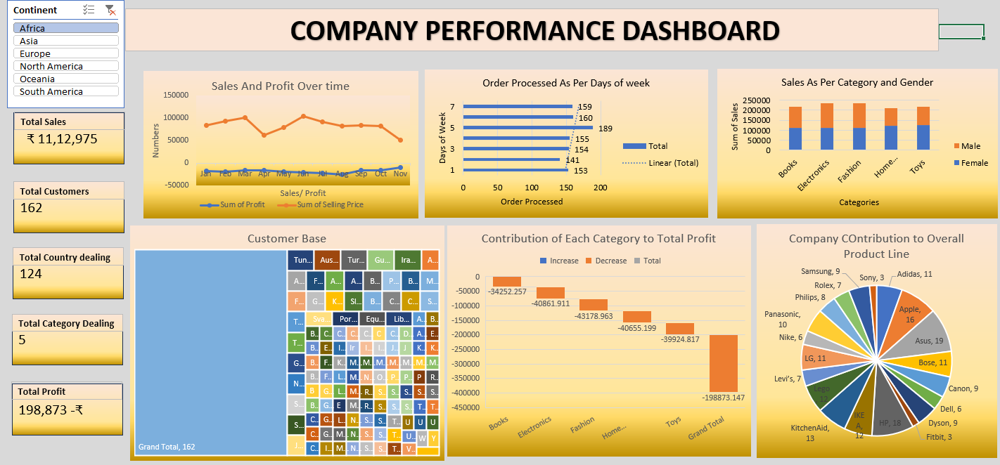

# 📊 Company Performance Dashboard

## 📌 Project Overview
The **Company Performance Dashboard** is an interactive business intelligence solution built to analyze and monitor key organizational metrics such as sales, profit, customer base, and product performance.  
This dashboard provides a consolidated view of business health across **time, geography, product categories, and brands**, enabling stakeholders to make data-driven decisions quickly and effectively.

---

## 🎯 Business Objectives
- Monitor overall company performance using key KPIs
- Analyze monthly sales and profit trends
- Identify high-performing and underperforming product categories
- Understand customer distribution across countries
- Evaluate brand-level contribution to the product line
- Support strategic decision-making through visual insights

---

## 📈 Key Performance Indicators (KPIs)
| Metric | Value |
|------|------|
| Total Sales | ₹ 11,12,975 |
| Total Profit | ₹ 1,98,873 |
| Total Customers | 162 |
| Countries Covered | 124 |
| Product Categories | 5 |

---

## 📊 Dashboard Features & Analysis

### 📅 Sales and Profit Trend Analysis
- Visualizes monthly sales and profit patterns.
- Identifies seasonal trends and revenue fluctuations.
- Helps management plan promotions and inventory.

### 📦 Orders Processed by Day of Week
- Displays order volume across weekdays.
- Assists in operational workload planning.
- Highlights peak and low-demand days.

### 🛍 Sales by Category and Gender
- Compares male vs female contribution across product categories.
- Enables customer segmentation and targeted marketing strategies.

### 🌍 Customer Base Distribution
- Treemap visualization showing customer count by country.
- Highlights key geographic markets driving customer acquisition.

### 💰 Category Contribution to Total Profit
- Shows profit and loss contribution for each category.
- Helps identify categories requiring optimization or strategic focus.

### 🏷 Brand Contribution to Product Line
- Analyzes brand-wise contribution to overall sales.
- Supports vendor performance evaluation and portfolio decisions.

---

## 🛠 Tools & Technologies
- **Microsoft Excel**
  - Pivot Tables & Pivot Charts
  - Slicers for interactive filtering
  - Advanced dashboard formatting
- **Data Cleaning & Transformation**
- **Business Intelligence & Visualization**

---

## 📚 Dataset Information
- Synthetic / simulated dataset created for analytical and visualization purposes.
- Includes sales transactions, customer demographics, product categories, and brand details.

---

## 🚀 Use Cases
- Executive business performance tracking
- Sales and profitability analysis
- Market and customer segmentation
- Category and brand-level strategy planning

---

